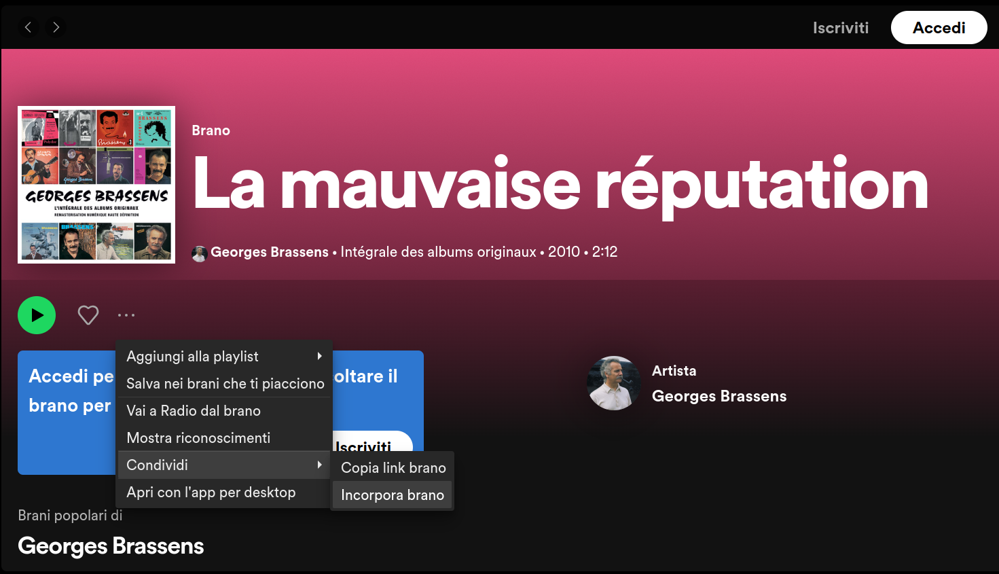
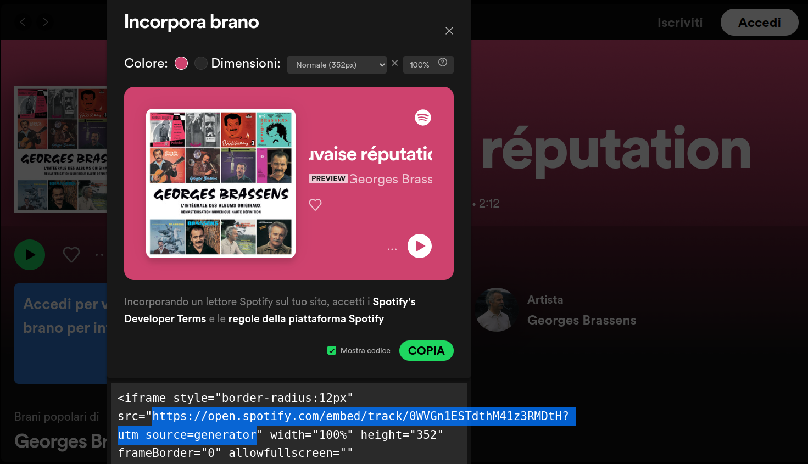

# SongBook
Hi, this is my SongBook!
The idea is quite simple:
- Add songs (as `html` files) or authors (as `folders`) 
- Run the `CollectSongs.py`
- Enjoy the SongBook!

It can be used offline, opening `index.html` in a web browser OR via a GitHub Page, based on a GitHub Repository.

This is the case for the [page](https://b-vitali.github.io/SongBook/) based on this repo.

## How to Add ...
### A song
Let's add the song *La mauvaise réputation* to our SongBook:

1. Create a `La mauvaise réputation.html` file in the appropriate folder: `songs/French/Georges Brassens/La mauvaise réputation.html`
1. Wirte in this file the lyrics/tabs of the song
1. Add the necessary HTML pieces
    ```
    <h2>La mauvaise réputation</h2></a>
    <div class="multiline-text">

    Lyrics/TABs

    </div>
    ```

1. To add the spotify embedded player takes a bit more effort
    1. Go on spotify and find the song *La mauvaise réputation*
    1. Click on "..."/share/embedded
    
    1. Check the box to *see code* and copy the link
    
    1. Paste the link in the `La mauvaise réputation.html` file
        ```
        <h2>La mauvaise réputation</h2></a>
        https://open.spotify.com/embed/track/0WVGn1ESTdthM41z3RMDtH?utm_source=generator
        <div class="multiline-text">

        Lyrics/TABs

        </div>
        ```  
1. Now open a terminal and run `path/to/SongBook$ python3 CollectSongspy`  
1. **DONE !**

### An Author
Just create a new folder with the author's name in the corresponding language folder.

### A language
1. Create the NewLanguage language folder and populate it with authors and songs
1. Link this folder in the `index.html`
    ```
    <body>
    <header>
        <h1>
            Welcome to our SongBook!
            
        </h1>
        <h3>We hope you'll enjoy your staying...</h3>
    </header>
    <nav>
        <ul>
            <li><a href="English_songbook.html">English</a></li>
            <li><a href="French_songbook.html">Français</a></li>

            <!-- This is the way to add languages -->
            <li><a href="NewLanguage_songbook.html">NewLanguage</a></li>

        </ul>
    </nav>
    <footer>
        <p>&copy; Our SongBook</p>
        <span id="last-commit"></span>
    </footer>
    </body>
    </html>
    ```
1. **DONE !**

## Known issues
1. **ScreenSizes**: Font resizing, and button overlapps are still a problem for the different screen sizes... working on it!

1. **Spotify**: If you are not logged in spotify, changing song and starting the second preview will not stop the first to run and will play in parallel.

## Structure
The layout of the repo is the following:

### Main part
- index.html
- CollectSongs.py
- songs
    - language1
        - author1
            - song1
            - song2
            - ...
        - author2
            - ...
    - language2
        - ...
    - ...

Running CollectSongs.py will generate `language1_songbook.html`, `language2_songbook.html`, ...

Changes in the folders for the authors and/or in the html files for the songs will be automatically propagated to these "_songbook.html".

NB: As of right now, the different languages are **not** collected automatically in the `index.html`. 

**If you add a language you need to link it manually, following the example**

### Esthetics
- PNG for the example in this `README.md`
- PNG for the logo
- `LogoColor.py` to change the color of the logo
- CSS
    - `colors.css` for the palette
    - `index.css`  for formatting
    - `songss.css` for formatting

### Additional functionality
- JS
    - `common.js` to fetch the last commit
    - `songs.js`  to print to file the lyrics 

